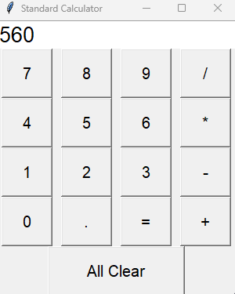

# Standard Calculator App using Python

This is a simple calculator application built using Python and the Tkinter library. It provides a graphical user interface for performing basic arithmetic calculations.

## Table of Contents

- [Description](#description)
- [Features](#features)
- [Usage](#usage)
- [Screenshots](#screenshot)
- [Installation](#installation)
- [Contributing](#contributing)
- [License](#license)

## Description

This calculator application allows users to perform basic arithmetic operations such as addition, subtraction, multiplication, and division. It offers a user-friendly graphical interface that enables users to input expressions and receive computed results.

## Features

- User-friendly graphical interface
- Supports addition, subtraction, multiplication, and division
- Basic error handling for invalid expressions
- Clear button to reset the input field

## Usage

1. Enter the numbers and operators using the buttons provided.
2. Click the "=" button to calculate the result of the expression.
3. Clear the input field using the "C" button.
4. The application displays the calculated result or an error message.

## Screenshots

  

 

## Installation

1. Clone the repository or download the project files.
2. Make sure you have Python installed on your system.
3. Navigate to the project directory in your terminal.
4. Run the following command to start the calculator application:

## Contributing 
Contributions to this project are welcome! If you find any issues or have suggestions for improvements, please feel free to create a pull request or submit an issue on the project's GitHub repository.

## License
This project is licensed under the MIT License.

Created by Anish Singh .

